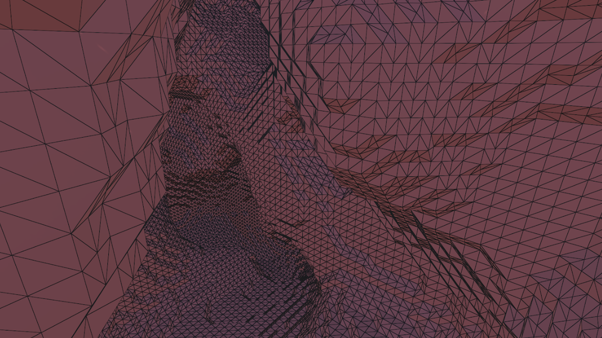
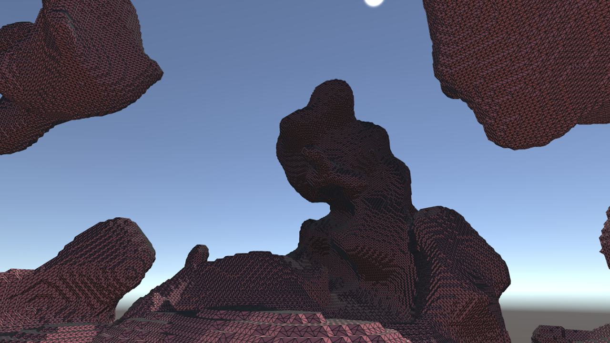

# Learning_Cubes
Experiments with marching cubes, marching squares, and procedural mesh generation.

The "Interactive Cubes" branch contains multiple prefabs that are helpful for experimenting with marching cubes basics and learning how the algorithm works.

Vertices hidden            |  Vertices visible
:-------------------------:|:-------------------------:
  |  

